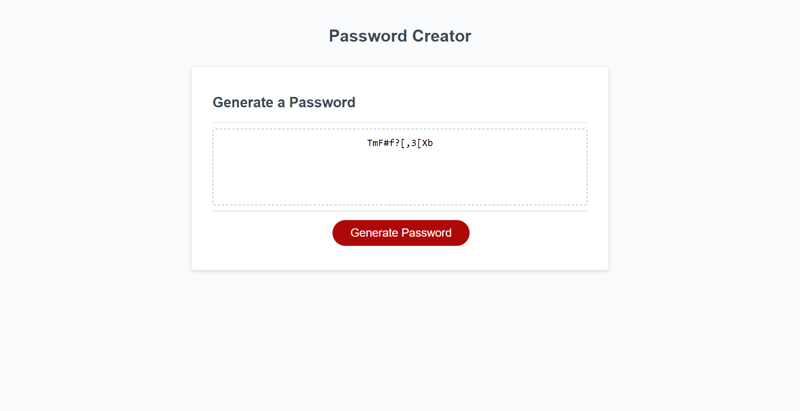

# Password Creator

## Description

The aim of this project was to create an application that can be used to generate a random password based on the user’s chosen criteria.

The project specified that the application should run in the browser and include HTML and CSS that is dynamically updated by JavaScript, as well as an interface that is responsive and adapts to multiple screen sizes.

The project criteria further specified that the application should prompt users for the following password choices:

* Character choices (including uppercase, numerical and special)
* Password length (between 8 and 128)

Upon submitting their preferences, the project criteria states that the generated password (based on the user’s choices) should either be displayed in an alert or written to the page. 

## Build

As per the project criteria, the application’s functionality has been built using Javascript.

While the starter HTML and CSS code has been tested to ensure it meets the project criteria (i.e. updates dynamically and is responsive to multiple screen sizes), no updates were deemed necessary to meet the criteria at this stage (i.e. in this iteration of the project).

The Javascript code has been commented throughout with pseudocode, breaking the project into tasks and sub-tasks (labelled as ‘TASKS’). Thorough comments to explain the developer’s understanding and rationale have also been included in the code (labelled as ‘WORKINGS’).

## Installation

N/A

## Usage

Users navigate to the webpage via the URL ([Password Creator](https://code0em.github.io/password-create/)). When on the webpage, primarily, the browser displays a series of confirm dialog boxes. Each of these asks the user to input their character choices for the password (i.e. a series of yes/no questions).

Note: the default character choice is lowercase only (i.e. if the user declined all of the character choices, their generated password would include only lowercase characters). Hence, by default, lowercase characters are included regardless of the user’s choice of other characters. 

When all of the character choices have been made, a prompt dialog box is displayed, asking the user to input their chosen password length. The prompt copy specifies that this must be between 8 and 128. If the user inputs a number outside of this range (or not a number), a further prompt dialog box is displayed, asking the user to try again. This process continues until an accepted length is inputted by the user.

When the user’s password length has been chosen (and this meets the length criteria), an alert dialog box is displayed. The alert copy thanks the user for their password choices and instructs them on how to generate their password.

Upon selecting the ‘Generate Password’ button in the browser, the user’s generated password is displayed in the box above the button (i.e. the card body).

On a resolution of 1400px, the application will display the generated password as follows:

Note: in the above example, the user choices were to include uppercase, numerical and special characters and a password length of 12.

## Credits

Credit given to edX (2023) for providing the starter code.

Credit also given to FreeCodeCamp Forum (2021), GeeksforGeeks (2023) and W3Schools (no date), whose various pages built upon the developer’s existing knowledge of the Javascript methods used throughout the build (credits also cited in code comments).

## Licence

Distributed under the MIT License. See `LICENSE.txt` for more information.

## Acknowledgments

Code written by Code0Em ([email](mailto:code.em@outlook.com)/ [GitHub](https://github.com/Code0Em)).

## References

edX (2023) [*Build new skills. Advance your career*](https://www.edx.org/).

GeeksforGeeks (2023) [*How to select a random element from array in JavaScript?*](https://www.geeksforgeeks.org/how-to-select-a-random-element-from-array-in-javascript/).

W3Schools (no date) [*JavaScript parseInt() Method*](https://www.w3schools.com/jsref/jsref_parseint.asp#gsc.tab=0).

W3Schools (no date) [*JavaScript Random Integers*](https://www.w3schools.com/js/js_random.asp).

W3Schools (no date) [*JavaScript String concat() Method*](https://www.w3schools.com/jsref/jsref_concat_string.asp).